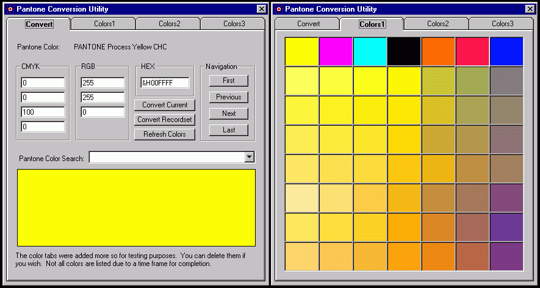



## Pantone to CMYK to RGB to HEX \(Update\)

### Description

This is an update to my previous listing. This is a fix for the factor of black which was brought to my attention. In this fix your panton black is converted to RGB(0,0,0) like it should be. If anyone has any other code for converting CMYK to RGB please share. It took me a while to find what I could.
 
### More Info
 

             |
---                |---
**Submitted On**   |2001-05-21 16:13:32
**By**             |[Jesse E](https://github.com/Planet-Source-Code/PSCIndex/blob/master/ByAuthor/jesse-e.md)
**Level**          |Intermediate
**User Rating**    |4.0 (8 globes from 2 users)
**Compatibility**  |VB 5\.0, VB 6\.0
**Category**       |[Complete Applications](https://github.com/Planet-Source-Code/PSCIndex/blob/master/ByCategory/complete-applications__1-27.md)
**World**          |[Visual Basic](https://github.com/Planet-Source-Code/PSCIndex/blob/master/ByWorld/visual-basic.md)
**Archive File**   |[Pantone to198725212001\.zip](https://github.com/Planet-Source-Code/jesse-e-pantone-to-cmyk-to-rgb-to-hex-update__1-23333/archive/master.zip)

